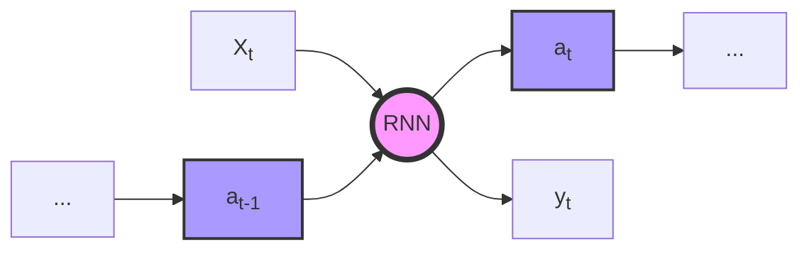
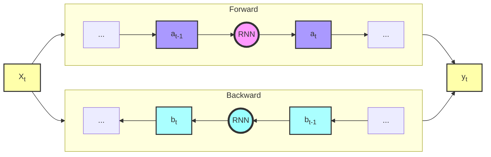

# Bidirectional RNN (BRNN)

## Introduction

Bidirectional Recurrent Neural Networks (BRNNs) are a sophisticated variant of traditional RNNs designed to address a fundamental limitation in sequential input processing. In standard RNNs, the meaning of a word or input element might depend on another that hasn't yet appeared in the sequence. This can lead to incomplete or incorrect interpretations of the input data.

For example, consider the following sentences:
1. "Rex barked loudly at the mailman."
2. "The Rex roared fiercely in the Jurassic period."

In these sentences, the meaning of "Rex" is only fully understood later in the context. BRNNs are designed to capture both past and future context, allowing for more accurate predictions and interpretations.

It's worth noting that the RNN blocks in Bidirectional RNNs can be substituted by more advanced recurrent units such as Gated Recurrent Units (GRU) or Long Short-Term Memory (LSTM) blocks, further enhancing their capability to capture long-term dependencies.

However, BRNNs have a limitation: they require the entire sequence of data to make a prediction. This makes them challenging to use in scenarios where data flows continuously, such as real-time speech-to-text applications.

## Architecture

To understand the architecture of BRNNs, let's first look at the structure of a standard RNN unit:

Now, let's look at the architecture of a Bidirectional RNN:

Note that Xt should be connected to the RNN units and so should Yt but this occasionates a mermaid bug.

In a BRNN, each time step t has both a forward ($a^t_{}$) and backward ($b^t_{}$) hidden state. The output at each time step is typically computed as a function of both these hidden states:

$\hat{y}^t = g(W_y[a^t_{}, b^t_{}])$

Where $g$ is an activation function, $W_y$ is a weight matrix, and $[a^t_{}, b^t_{}]$ represents the concatenation of the forward and backward hidden states.
This architecture allows the network to incorporate information from both past and future context at every time step, leading to more informed predictions.