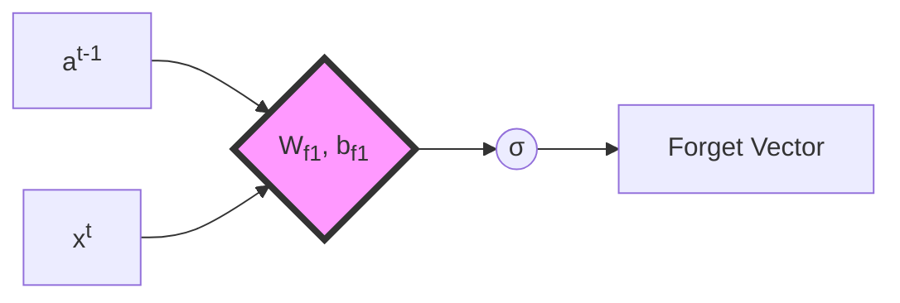
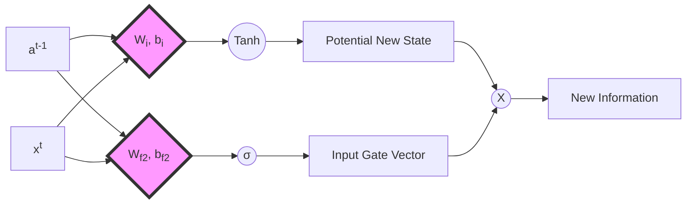
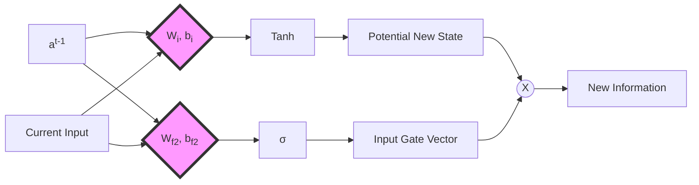
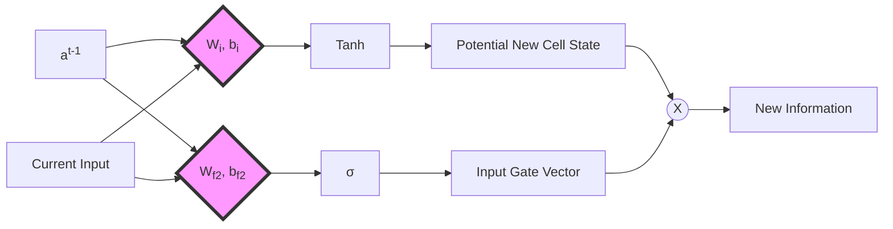
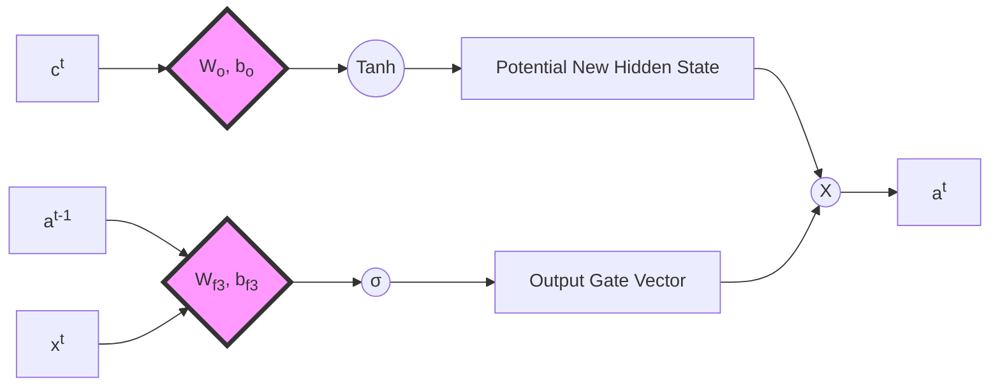
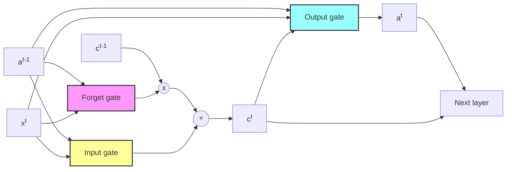

# Long Short-Term Memory (LSTM) Networks

## Introduction

Long Short-Term Memory (LSTM) networks are a significant advancement in the field of neural networks, particularly in sequence modeling tasks. They address key limitations of traditional Recurrent Neural Networks (RNNs) and pave the way for understanding more complex architectures like Transformers.

Key features of LSTMs:
1. Cell state: Captures long-term dependencies (long memory)
2. Hidden state: Focuses on immediate changes, similarly to RNNs (short memory)
3. Gates: Control modifications to cell and hidden states
4. Activation functions usage:
   - Tanh: Generates valuable information for the network
   - Sigmoid: Determines updates/forgetting of computed information

While LSTMs offer improved accuracy over simpler architectures, their complexity can impact performance. Despite this trade-off, they represent a crucial step in the evolution of neural network design.

## Architecture

LSTMs consist of several interconnected components, each serving a specific purpose in managing information flow through the network.

### 1. Forget Gate

Also known as the update gate, this component determines what information from the previous cell state should be retained based on the current input and last hidden state.

Formula:
$\gamma_{f1} = \sigma(W_{f1} [a^{t-1}, x^t] + b_{f1})$

Where:
- $\sigma$ represents the sigmoid function
- $W_{f1}$ is the weight matrix for the forget gate
- $a^{t-1}$ is the previous hidden state
- $x^t$ is the current input
- $b_{f1}$ is the bias term for the forget gate

### 2. Input Gate

The input gate decides which parts of the new input should be added to the long-term memory (cell state). It computes a potential new cell state and uses a forget gate to indicate which values should not be maintained.

Formula:
$\gamma_i = \tanh(W_i [a^{t-1}, x^t] + b_i) \cdot \sigma(W_{f2} [a^{t-1}, x^t] + b_{f2})$

Where:
- $\tanh$ is the hyperbolic tangent function
- $W_i$ and $W_{f2}$ are weight matrices
- $b_i$ and $b_{f2}$ are bias terms

### 3. Output Gate

The output gate generates the new hidden state using the updated cell state. Similar to the input gate, it employs a forget gate to determine which parts of the processed cell state are unnecessary for the hidden state (short-term memory).

Formula:
$\gamma_o = \tanh(W_o c^t + b_o) \cdot \sigma(W_{f3} [a^{t-1}, x^t] + b_{f3})$

Where:
- $c^t$ is the current cell state
- $W_o$ and $W_{f3}$ are weight matrices
- $b_o$ and $b_{f3}$ are bias terms

### 4. Cell State and Hidden State Updates

To complete the LSTM architecture, we need to include the formulas for updating the cell state and hidden state:

Cell State Update:
$c^t = \gamma_{f1} \cdot c^{t-1} + \gamma_i$

Hidden State Update:
$a^t = \gamma_o$

These formulas show how the cell state is updated using the forget gate and input gate outputs, while the hidden state is directly set to the output gate's result.

### 5. Overall architecture

## Conclusion

LSTMs represent a significant improvement over traditional RNNs by introducing mechanisms to better handle long-term dependencies. While they have been largely superseded by more advanced architectures like Transformers in many applications, understanding LSTMs is relevant for grasping the evolution of sequence modeling in deep learning.