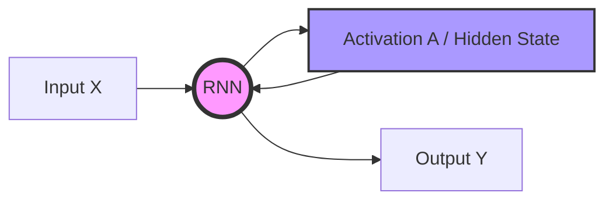
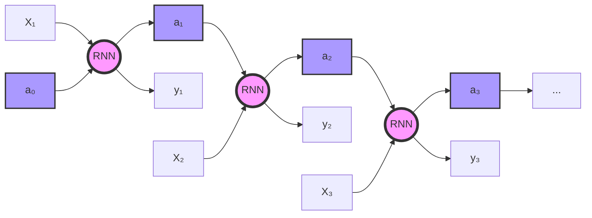
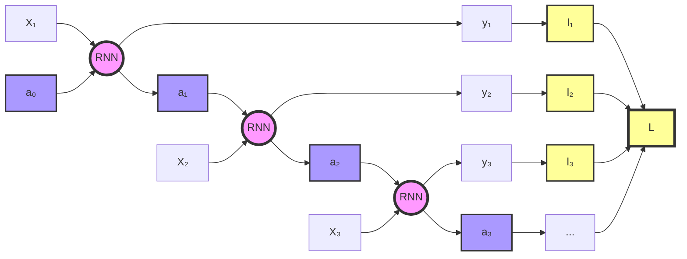
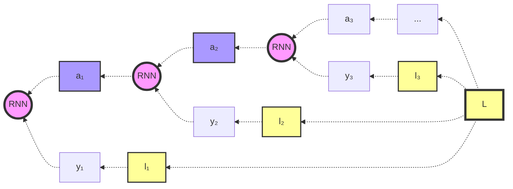
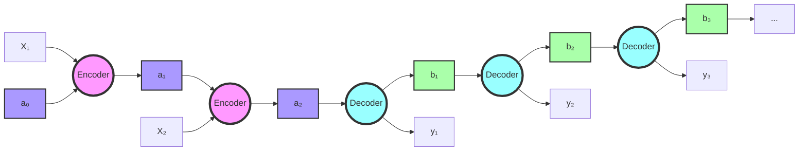
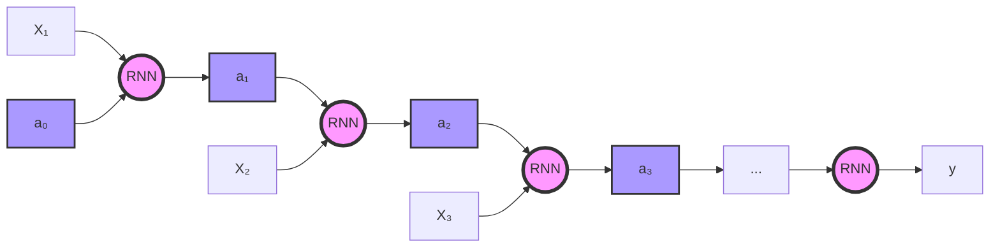
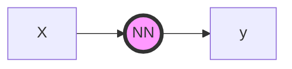
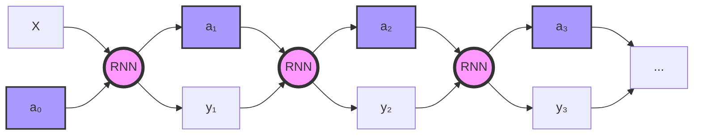

# Recurrent Neural Networks (RNNs)

## Introduction

Recurrent Neural Networks (RNNs) are a foundational step for understanding more complex models like Long Short-Term Memory (LSTMs) and Transformers. They are crucial because they address the challenge of sequence processing, which is fundamental in tasks involving time-series, natural language, and speech.

Traditional feedforward neural networks, such as Multi-Layer Perceptrons (MLPs), struggle with sequence data, especially if the sequence has variable length. MLPs treat every input element independently, which results in problems when processing sequential information, given that some unoptimal workaround (such as using padding) should be used. For example, in text processing, MLPs may represent the same word differently depending on its position in the sentence. This inconsistency arises because MLPs don’t share weights across different positions in the sequence, unlike Convolutional Neural Networks (CNNs), which have positional invariance for image data. To illustrate this, consider a name like "Harry" that appears in different parts of a sentence—an MLP might fail to recognize it consistently as a personal name across varying positions.

- "Harry went to the store."
- "The store was visited by Harry."
- "Did you see Harry at the store?"

An MLP will use different weights to process the word `Harry` in this example for each phrase, which might result in very different interpretations of the same name.

RNNs solve this by sharing weights across time steps, allowing them to process variable-length sequences and generalize better (using the same weights for each time step of the sequence).

## Architecture

RNNs process input sequentially, one element (e.g., a word in a sentence) at a time, moving from left to right. This sequential processing allows the network to retain some memory of previous inputs, but it also poses a challenge: if the relevant context comes later in the sequence, RNNs may struggle to incorporate that information effectively. For example, consider a sequence where the word "Rex" appears. RNNs would struggle to determine if "Rex" is a dog’s name or a dinosaur unless the word "dog" or "dinosaur" appears before "Rex". Bidirectional RNNs address this limitation by processing sequences from both directions, allowing context from both past and future words to inform the interpretation of each word.

The architecture of an RNN can be represented in two ways: folded and unfolded. Let's look at both representations:

1. Folded RNN structure:

In this folded representation, the RNN processes the input X and updates its hidden state A, which is then fed back into the RNN for the next time step. To better understand how the RNN processes sequences over time, we can unfold it across time steps:

In this unfolded representation, we can see how the hidden state and outputs are updated at each time step. Each RNN module (RNN1, RNN2, RNN3, etc.) shares the same parameters, emphasizing the weight-sharing aspect of RNNs.

### Key Aspects of RNNs:

- **Shared Parameters:** RNNs reuse the same parameters (weights) for each time step in the sequence. This contrasts with MLPs, where each input might have a unique set of parameters, depending on its position.
- **Recurrent Connections:** RNNs maintain a hidden state that is updated at each time step. The hidden state at time step `t` depends on the current input and the previous hidden state, which allows the network to retain information across the sequence. Usually $a^{\langle 0 \rangle}$ is a zero vector or a randomly initialized one.

### Mathematical Representation

The hidden state update can be described as:

$$ a^{\langle t \rangle} = g(W_{aa} \cdot a^{\langle t-1 \rangle} + W_{ax} \cdot x^{\langle t \rangle} + b_a) $$

Where:
- $a^{\langle t \rangle}$ is the hidden state at time step $t$.
- $g$ is the activation function (often the *tanh* function).
- $W_{aa}$ and $W_{ax}$ are weight matrices.
- $x^{\langle t \rangle}$ is the input at time step $t$.
- $b_a$ is the bias term.

This can be simplified by concatenating the weight matrices $W_{aa}$ and $W_{ax}$, and the input and hidden states:

$$ a^{\langle t \rangle} = g(W_a \cdot [a^{\langle t-1 \rangle}, x^{\langle t \rangle}] + b_a) $$

The output at each time step is computed as:

$$ y^{\langle t \rangle} = g(W_{ya} \cdot a^{\langle t \rangle} + b_y) $$

Here, $W_{ya}$ is the weight matrix for the output, and $b_y$ is the output bias. The activation function *tanh* is often used for the hidden state, while the output activation depends on the task (e.g., softmax for classification tasks).

## Backpropagation Through Time (BTT)

Loss is computed for each time step and added into a singular final loss, which is used for backpropagation.

This graph illustrates the forward pass of Backpropagation Through Time. It shows how input (X) and previous hidden states (a) are processed through RNN cells at each time step, producing outputs (y) and losses (l). These individual losses are then combined into a final loss (L).

This graph demonstrates the backward pass of Backpropagation Through Time. It shows how gradients flow backwards from the final loss (L) through each time step, updating the RNN cells and their outputs. This process allows the network to learn from the entire sequence.

## Types of RNNs:

$T_{x}$ (input sequence) does not always match the length of $T_{y}$ (output sequence), so, depending on their lengths we have different RNN types.

1. Many-to-many (Same length)

This is the graph used as example before. It represents a scenario where the input sequence length matches the output sequence length.

Use case example: Part-of-speech tagging, where each word (input) corresponds to a grammatical tag (output).

2. Many-to-many (Different length - Encoder-Decoder)

Use case example: Machine translation, where the input sequence (source language) may have a different length than the output sequence (target language).

2. Many-to-one

Use case example: Sentiment analysis of a sentence or document, where a sequence of words (input) results in a single sentiment classification (output).

4. One-to-one

This is essentially a standard neural network, not an RNN:

Use case example: Simple classification tasks, like determining if an email is spam based on a fixed set of features.

5. One-to-many

Use case example: Music generation, where a single note and instument (input) generates a sequence of notes (output).

## Word Representation

When RNNs process text, they require a way to represent words as numerical vectors. Initially, **one-hot encoding** was used, where each word in the vocabulary was represented as a sparse binary vector. For instance, in a vocabulary of 10,000 words:
- The word "a" might be represented as a vector with a `1` in position 1 and `0`s elsewhere.
- The word "are" would have a `1` in position 457, and `0`s elsewhere.
- The word "perchance" could be in position 6754.
- The word "zyzzyva" could be in position 10,000.

Usually two tokens are reserved for uknown words $<UNK>$ and to represent the end of a sentence or text $<EOS>$

This approach, however, is inefficient for several reasons:
- **High dimensionality**: A vocabulary of 10,000 words would require vectors of length 10,000, which is computationally expensive.
- **No relationship between words**: One-hot encoding does not capture any semantic similarity between words. For example, the words "man" (position 6000), "woman" (position 9777), and "lion" (position 5831) are equally distant from each other in this representation, even though "man" and "woman" are semantically closer than either is to "lion."

To address these limitations, more efficient word representations such as **word embeddings** (e.g., Word2Vec, GloVe) were developed. These embeddings encode words in a dense, low-dimensional vector space where semantically similar words are closer together.
