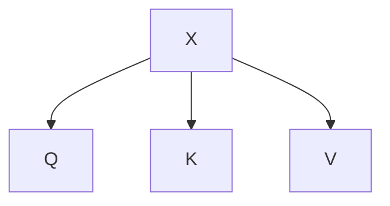

# Self-Attention

Self-attention, also known as scaled dot-product attention, is a mechanism for generating attention-based representations of each token in a sequence by considering its context. For example, given the sentence *"He went to Norway last month"*, the representation of the word "Norway" will depend on the surrounding words, rather than always having a fixed embedding.

To achieve this, each input token $X^{<i>}$ is projected into three different vectors: a query $Q^{<i>}$, a key $K^{<i>}$, and a value $V^{<i>}$. These vectors help the model determine how much each token should attend to every other token. Intuitively:

- $Q^{<i>}$ asks a context-related question about the token.
- $K^{<i>}$ provides information about what the token can contribute to answering a query.
- $V^{<i>}$ represents the token's content, which will be combined with the attention weights to form a richer representation.

To compute attention, we compare the query vector of the current token $q$ with the keys of all tokens $K$. The similarity scores are transformed via a softmax function to produce attention weights, which are then used to weight the values $V$:

$$A(q,K,V) = \sum_i \frac{\exp\left(\frac{qK^{<i>}}{\sqrt{d_k}}\right)}{\sum_j \exp\left(\frac{qK^{<j>}}{\sqrt{d_k}}\right)} V^{<i>}$$

Here, $d_k$ is the dimension of the key/query vectors. Dividing by $\sqrt{d_k}$ normalizes the dot products, preventing extremely large values as the dimensionality grows. This ensures stable and efficient training.

**Key Points**

1. Transformers create attention-based representations for each token without relying on convolutional layers or recurrent structures; the key concept is self-attention.

2. The query, key, and value vectors work together so the model can figure out which tokens provide the most relevant information to enhance a given token's representation.

3. Using a normalization factor $\sqrt{d_k}$ keeps dot product values at a manageable scale as the vector dimensions increase.